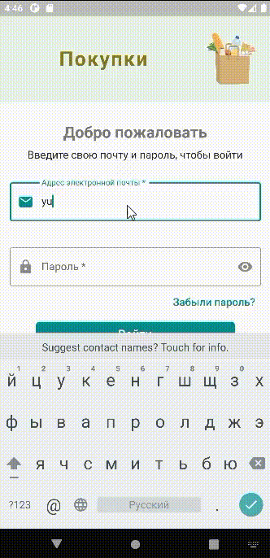

# firebase_purchase

Это учебное Flutter приложение выполнено с целью научиться использовать сервисы Firebase во Flutter-проектах. Приложение представляет из себя  список покупок. В списке есть наименование покупки и признак, куплено или нет. В него можно добавить необходимую покупку и пометить уже существующую покупку, как купленную.

Создан проект в Firebase и выполнено подключение к Android, iOS, Web.

Создана база данных Firestore Database со списком покупок и подключена к приложению.

Сделано использование в проекте фоновой картинки из Storage.

Сделана аутентификация пользователей с помощью email и пароля. Предусмотрено выполнение регистрации пользователей, с верификацией email. Добавлена возможность сброса пароля.

Для управления состоянием приложения в проекте используется библиотека flutter_bloc с реализацией в виде Cubit.

